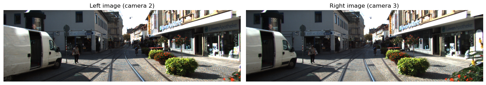
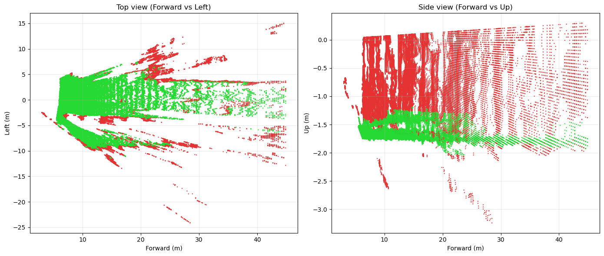
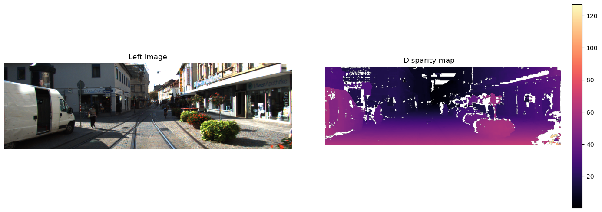
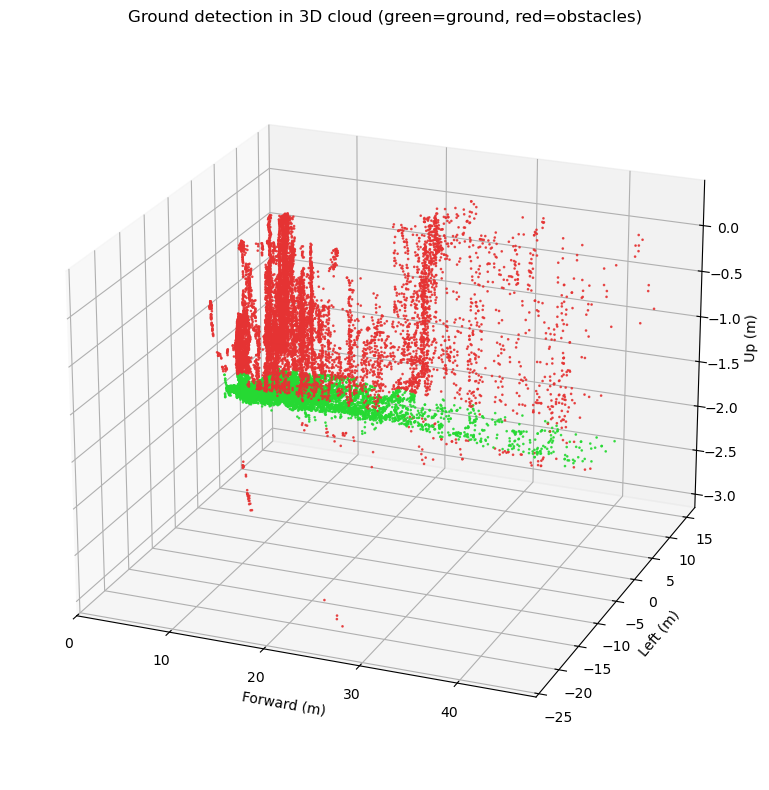

# HW1: Hough + RANSAC

## Что за задание

Первая домашняя работа состоит из двух частей:

- `wall_detection_hough.ipynb` — поиск прямых стен по 2D lidar-точкам через преобразование Хафа.
- `ground_detection_ransac.ipynb` — поиск плоскости земли в 3D облаке точек через RANSAC.

Исходный PDF: `S26_AR_HW1_Hough line detector_RANSAC plane detector.pdf`.

## Как решалось

Для части 1.1 в ноутбуке генерируются синтетические комнаты с шумом, пропусками лучей и выбросами. Затем строится Hough accumulator, находятся локальные пики и поверх облака точек рисуются найденные линии.

Для части 1.2 используется локальный поднабор KITTI из `data/3d`. Так как Velodyne-файлов нет, облако восстанавливается по стереопаре и калибровке, после чего собственная реализация RANSAC находит доминирующую плоскость и делит точки на `ground` и `obstacles`.

## Результаты

### 1.1 Поиск стен через Hough

- В сцене `rect_plus_diagonal` выделяются две главные структуры, а в аккумуляторе появляются два сильных пика: около `θ≈120°, ρ≈−1.25` с примерно `240` голосами и около `θ≈70°, ρ≈4.20` с примерно `98` голосами.
- В `l_shaped_room` один физический угол даёт несколько близких гипотез линий из-за частичной видимости и дискретизации.
- В `irregular_with_angles` доминирует один сильный пик около `θ≈93°, ρ≈−0.91` с примерно `265` голосами, а слабые стены отсекаются порогом.

### 1.2 Поиск плоскости земли через RANSAC

- По стереопаре получено плотное облако из `204,808` точек при размере disparity map `375x1242` и baseline `0.5327 m`.
- RANSAC на подвыборке `60k` точек нашёл почти горизонтальную доминирующую плоскость.
- В итоговой классификации `116,325` точек (`56.8%`) отнесены к земле и `88,483` (`43.2%`) — к препятствиям.

## Выводы

- Hough хорошо извлекает доминирующие прямолинейные структуры, но при частичной видимости и сложной геометрии склонен выдавать несколько похожих линий вместо одной физической стены.
- RANSAC устойчиво отделяет плоскость земли от остальных объектов даже на шумном стереооблаке.
- Для улучшения 2D части полезны предфильтрация, проверка инлайеров по расстоянию до линии и последующее объединение сегментов.

## Как запустить

1. Перейти в папку `hw1_hough_ransac`.
2. Установить зависимости: `pip install -r requirements.txt`
3. Открыть нужный ноутбук:
   - `jupyter lab wall_detection_hough.ipynb`
   - `jupyter lab ground_detection_ransac.ipynb`

Для 3D части нужен локальный набор KITTI в `data/3d`.
