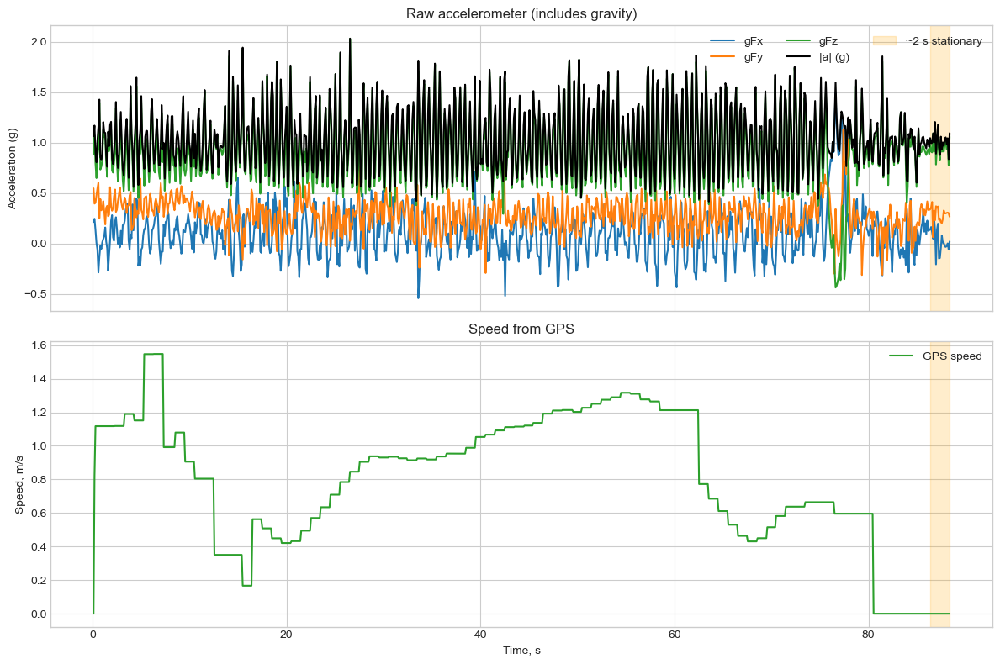
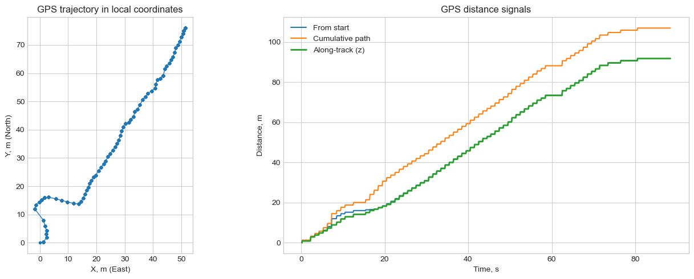
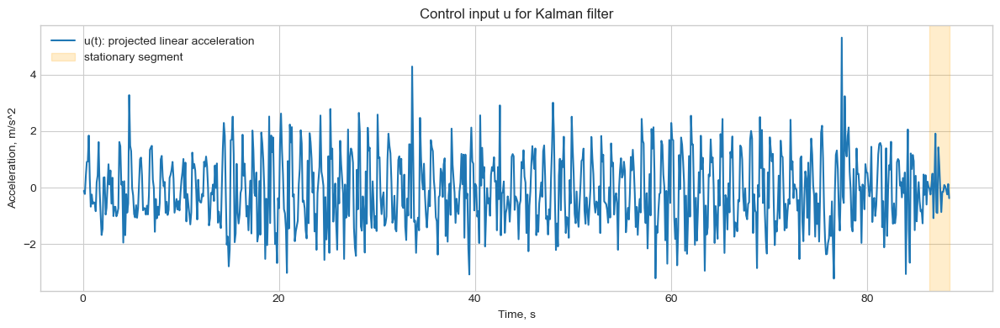
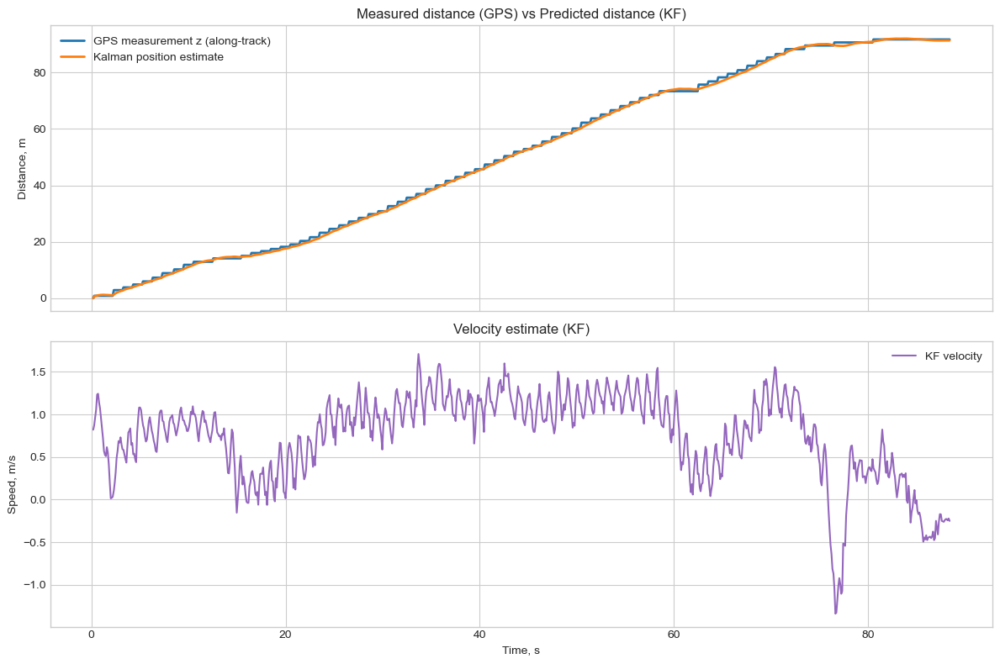

# HW2: Линейный фильтр Калмана

## Что за задание

Ноутбук `smartphone_linear_kalman.ipynb` решает задачу оценки траектории человека по данным смартфона из файла `2026-03-0916.48.43.csv`.

Исходный PDF: `S26_AR_HW2_Linear Kalman Filter for Smartphone sensors.pdf`.

## Как решалось

Сначала данные читаются из CSV, координаты GPS переводятся в локальные метры относительно старта, а по временному ряду строится базовый EDA. Затем оцениваются шумы измерений и запускается 1D линейный фильтр Калмана со state-вектором `x = [position, velocity]^T` и управляющим входом от акселерометра.

В финале Kalman-оценка сравнивается с GPS-измерениями по дистанции и скорости.

## Результаты

- Использовано `878/879` валидных GPS-точек на интервале `88.27 s`.
- Средний шаг дискретизации составил `0.1005 +/- 0.0017 s`.
- Средняя GPS-скорость — `0.802 m/s`, максимальная — `1.548 m/s`.
- Финальная пройденная дистанция по GPS — `91.75 m`, по фильтру Калмана — `91.39 m`.
- Абсолютное отличие в конце траектории — `0.36 m`.
- Ошибка фильтра относительно GPS along-track измерения: `RMSE = 0.676 m`.
- Для шума акселерометра оценены `acc_bias = 0.115 m/s^2` и `std_acc = 0.740 m/s^2`; для GPS использован fallback `std_meas = 3.000 m`.

## Выводы

- Данные достаточно качественные и равномерно дискретизированные, поэтому фильтр работает стабильно.
- Линейный Kalman smoother заметно уменьшает шум по положению по сравнению с GPS и даёт гладкую оценку скорости.
- Даже в простой 1D постановке sensor fusion уже даёт практический выигрыш по устойчивости траектории.

## Как запустить

1. Перейти в папку `hw2_linear_kalman`.
2. Установить зависимости: `pip install -r requirements.txt`
3. Запустить ноутбук: `jupyter lab smartphone_linear_kalman.ipynb`

CSV уже лежит рядом с ноутбуком.
