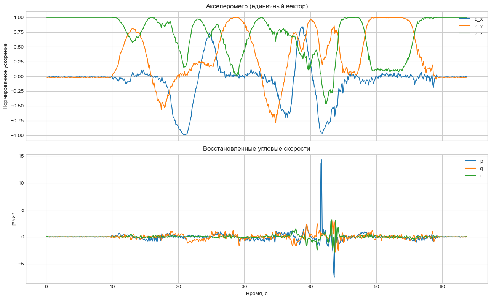
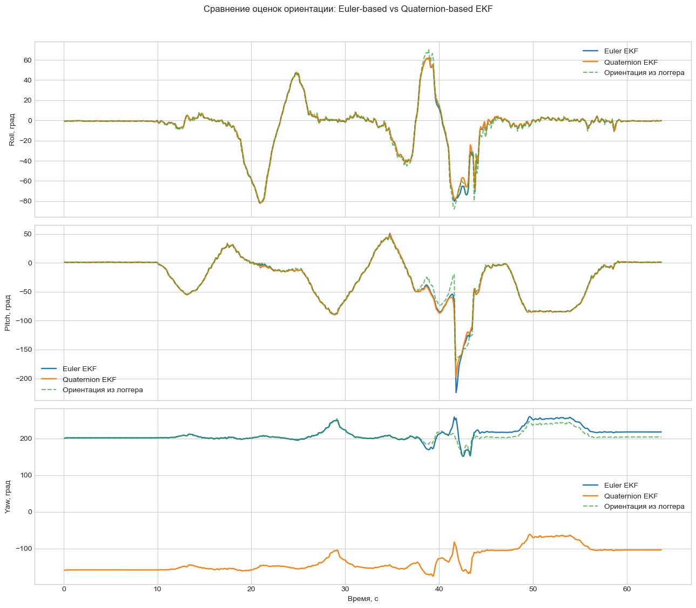
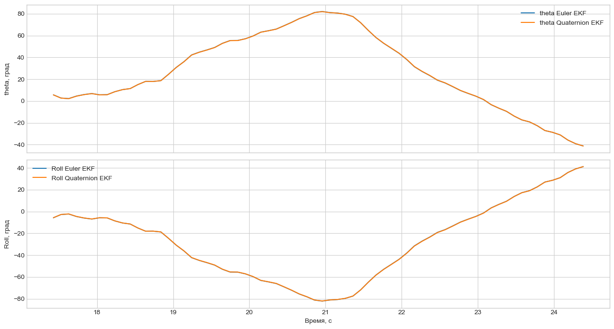
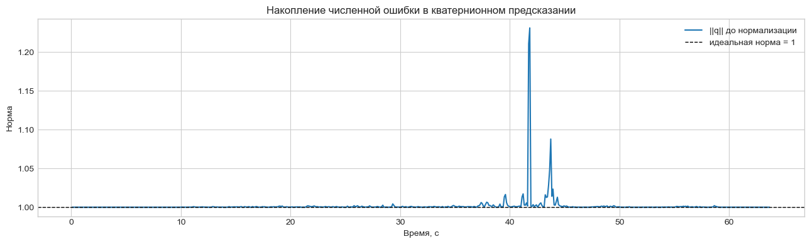

# HW3: Euler vs Quaternion EKF

## Что за задание

Ноутбук `euler_vs_quaternion_ekf.ipynb` сравнивает два варианта расширенного фильтра Калмана для оценки ориентации смартфона:

- EKF в представлении углов Эйлера
- EKF в представлении кватернионов

Исходный PDF: `S26_AR_HW3_Euler-based vs Quaternion-based EKF for Smartphone sensors.pdf`.

## Как решалось

Из `data.csv` загружаются компоненты ускорения и логгерные углы ориентации. Так как отдельного гироскопа в наборе нет, угловые скорости восстанавливаются из производных `Azimuth/Pitch/Roll`. После этого запускаются два EKF на одном и том же наборе данных, а затем сравниваются Roll/Pitch/Yaw, поведение около сингулярности и норма кватерниона до нормализации.

## Результаты

### Количественные метрики

| Угол | RMSE Euler vs logger, deg | RMSE Quaternion vs logger, deg | MAE \|Euler-Quaternion\|, deg |
|---|---:|---:|---:|
| Roll | 2.517 | 2.619 | 0.376 |
| Pitch | 5.521 | 5.524 | 0.560 |
| Yaw | 9.557 | 30.960 | 16.542 |

На этом наборе данных различия по `Roll` и `Pitch` малы: RMSE у двух фильтров почти совпадает. По `Yaw` лучше согласуется с логгером Euler-вариант: `9.557°` против `30.960°` у quaternion-варианта. Участок, рассмотренный как приближение к сингулярности, доходит примерно до `|theta| ≈ 82°` у оценки Euler и до `|theta_ref| ≈ 87.8°` у логгера; на нём оба фильтра остаются работоспособными, поэтому этот датасет не даёт явного практического преимущества quaternion-представлению, хотя его теоретическое преимущество в отсутствии сингулярности у состояния сохраняется.

## Выводы

- По `Roll` и `Pitch` оба фильтра работают почти одинаково: разница в RMSE составляет около `0.1°` или меньше.
- По `Yaw` на этом датасете лучше согласуется с логгером Euler-вариант: `RMSE = 9.557°` против `30.960°` у quaternion-варианта.
- На участке с большим `|theta|` оба фильтра остаются стабильными, однако при приближении к вертикали начинвет расти ошибка у Euler.
- Преимущество кватернионов здесь лучше формулировать как свойство представления: у них нет сингулярности `gimbal lock`, но этот конкретный датасет демонстрирует это скорее теоретически, чем через явный выигрыш в метриках.
- Норма кватерниона до нормализации уходит от единицы, поэтому нормализация на каждом шаге предсказания обязательна.

## Как запустить

1. Перейти в папку `hw3_ekf_orientation`.
2. Установить зависимости: `pip install -r requirements.txt`
3. Запустить ноутбук: `jupyter lab euler_vs_quaternion_ekf.ipynb`

Файл `data.csv` уже включён в репозиторий.
