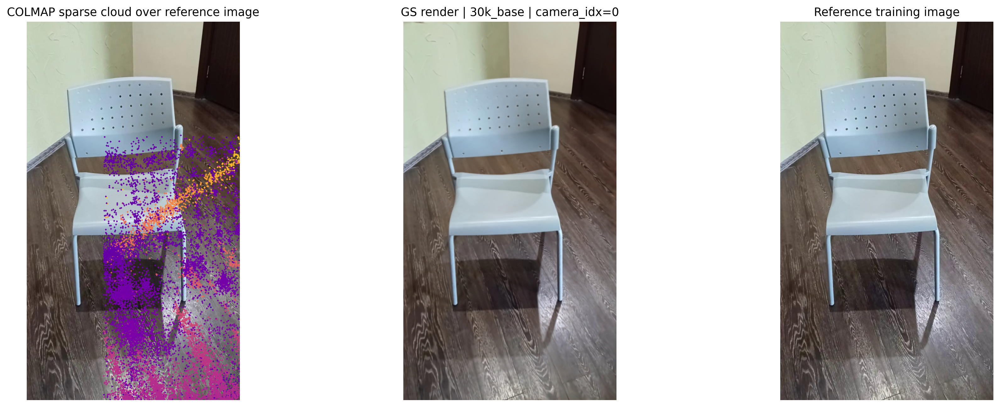
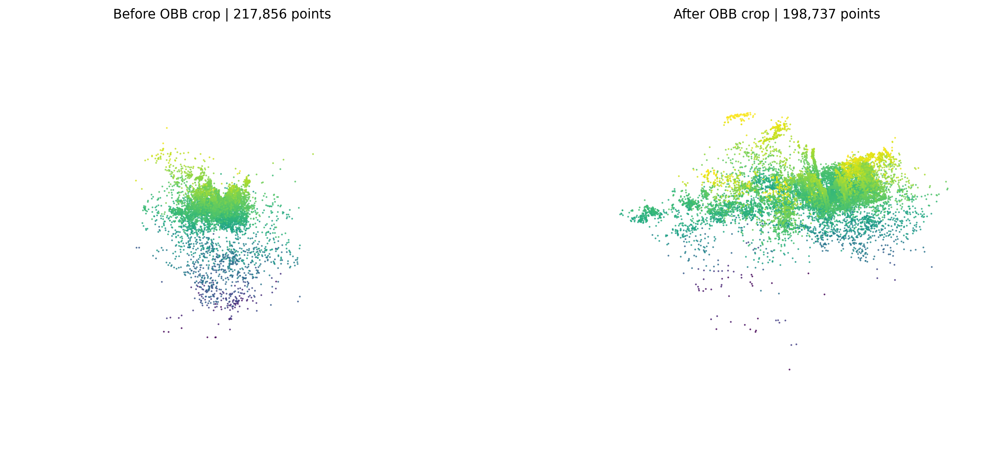
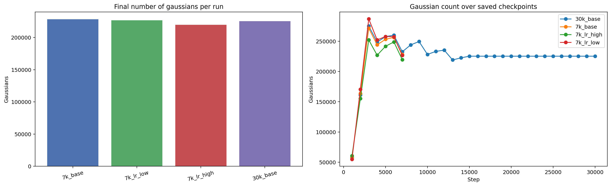

# HW4: Gaussian Splatting

## Что за задание

Ноутбук `gaussian_splatting.ipynb` строит полный пайплайн 3D Gaussian Splatting по видео `video.mp4`: от подготовки кадров до обучения и анализа финальной сцены.

Исходный PDF: `S26_AR_HW4_Gaussian Splatting.pdf`.

## Как решалось

Решение разбито на несколько этапов:

- из видео извлекаются кадры в `frames`
- нерезкие кадры и выбросы отфильтровываются, итоговый набор складывается в `good_frames`
- через `ns-process-data` подготавливается сцена в `processed_scene`
- обучаются несколько конфигураций Gaussian Splatting в `outputs`
- в `analysis` собираются сравнения рендера, crop-экспорт и график количества гауссиан по checkpoint-файлам

## Результаты

- Обозначения запусков:
  - `7k_base` — базовый запуск Gaussian Splatting на `7000` итераций без изменения ключевых hyperparameter'ов.
  - `30k_base` — тот же базовый сценарий, но с длинным обучением на `30000` итераций.
  - `7k_lr_low` — запуск на `7000` итераций с уменьшенным `learning rate` для параметра `means`, который отвечает за обновление положений гауссиан в пространстве.
  - `7k_lr_high` — запуск на `7000` итераций с увеличенным `learning rate` для `means`, то есть с более агрессивным обновлением положений гауссиан.
- Как читать имя эксперимента: число `7k` или `30k` показывает длительность обучения в тысячах итераций, `base` означает базовую конфигурацию, а `lr_low` и `lr_high` указывают на уменьшенный или увеличенный шаг обучения для `means`.
- После полного обучения `30k_base` финальный рендер почти совпадает с исходным кадром.
- OBB-crop уменьшил число экспортированных точек с `217856` до `198737`, то есть удалил около `19119` шумовых точек фона.
- Финальное число гауссиан:
  - `7k_base` — `228284`
  - `7k_lr_low` — `226629`
  - `7k_lr_high` — `219600`
  - `30k_base` — `225382`
- Для `30k_base` после примерно `13k-15k` итераций число гауссиан выходит на плато, что указывает на стабилизацию модели.
- Видео для облаков точек и рендеров:
  - [`7k_base.mp4`](video/7k_base.mp4)
  - [`7k_lr_low.mp4`](video/7k_lr_low.mp4)
  - [`7k_lr_high.mp4`](video/7k_lr_high.mp4)
  - [`30k_base.mp4`](video/30k_base.mp4)

## Выводы

- Gaussian Splatting успешно восстанавливает сцену даже на основе разреженной SfM-реконструкции.
- Полный запуск `30k_base` даёт наиболее стабильный и качественный визуальный результат.
- Увеличенный learning rate для `means` приводит к более агрессивной перестройке сцены и меньшему итоговому числу сплэтов.
- Обрезка по bounding box эффективно очищает фон без заметной потери структуры объекта.

## Как запустить

1. Перейти в папку `hw4_gaussian_splatting`.
2. Установить зависимости: `pip install -r requirements.txt`
3. Убедиться, что доступны `nerfstudio` CLI-команды (`ns-process-data`, `ns-train`, `ns-render`, `ns-export`) и GPU-окружение для `torch`.
4. Запустить ноутбук: `jupyter lab gaussian_splatting.ipynb`

Если нужен только просмотр результатов, достаточно открыть ноутбук и уже сохранённые файлы из `analysis`, `processed_scene` и `outputs`.
