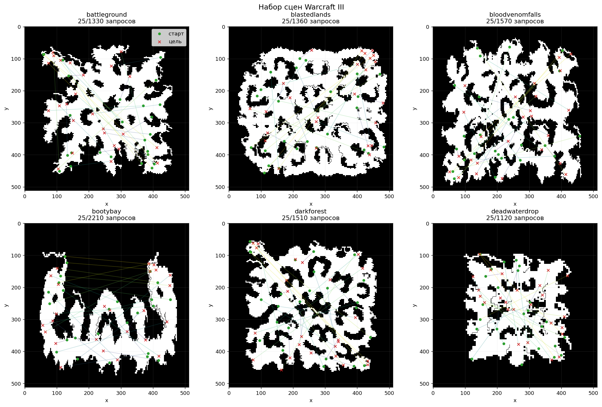
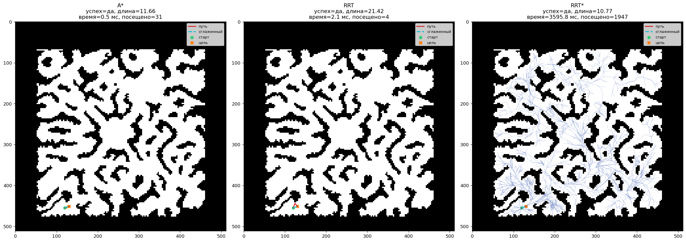
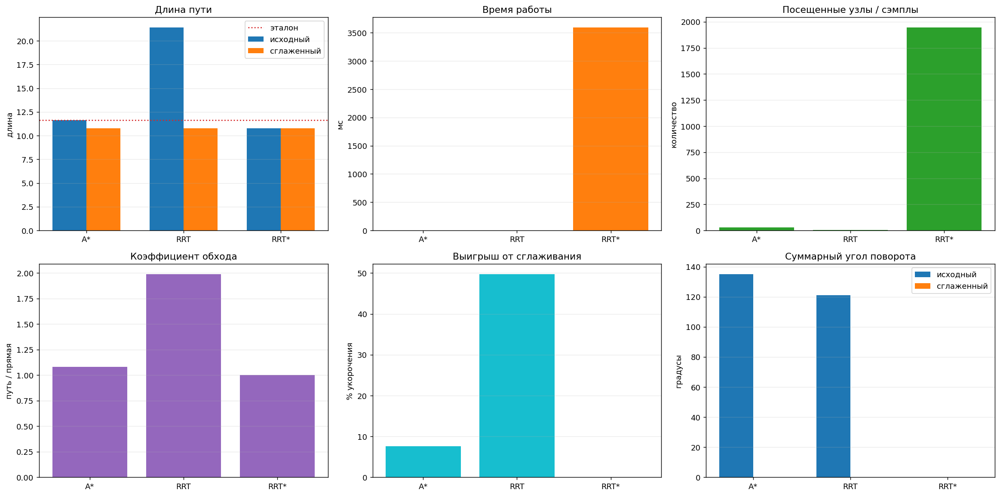
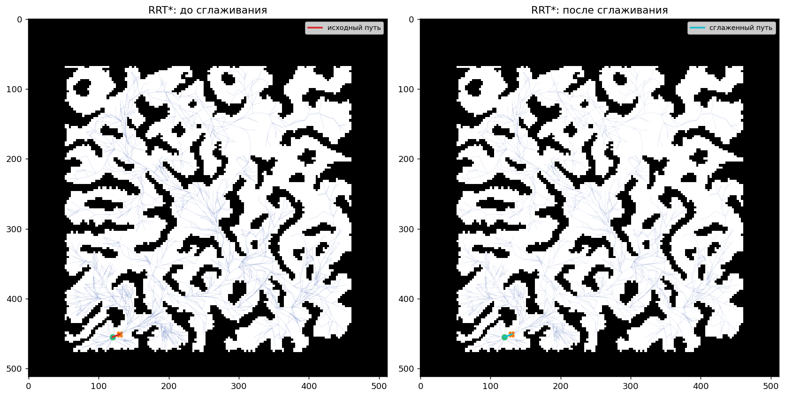
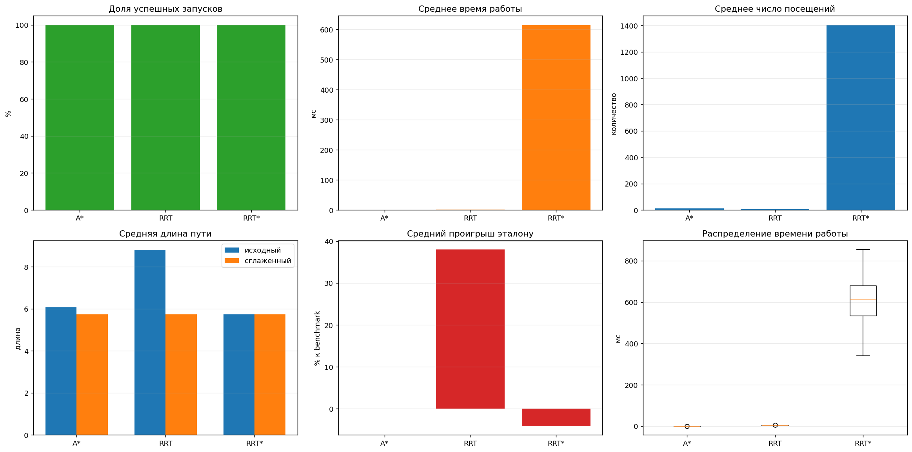
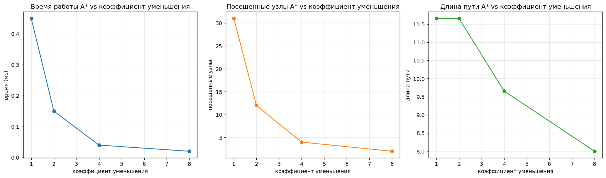

# HW5: Планирование пути

## Что за задание

Ноутбук [path_planning.ipynb](path_planning.ipynb) реализует полный пайплайн планирования пути в 2D:

- `A*` как эталонный алгоритм поиска на сетке.
- `RRT` как базовый sampling-based planner.
- `RRT*` как улучшенный вариант с перестройкой дерева.
- постобработку траектории через shortcut + gradient smoothing.
- сравнение по метрикам, визуализацию и экспорт анимации поиска.

Исходный PDF: `S26_AR_HW5_Path Planning.pdf`.

## Как решалось

Решение разделено на несколько частей:

- загрузка карт Warcraft III в формате MovingAI `.map` и сцен `.map.scen`
- корректный `A*` на octile-сетке с диагональными переходами и проверкой corner-cutting
- sampling-based поиск через `RRT` и `RRT*`
- сглаживание траектории после нахождения пути
- сравнение по времени, длине пути, числу посещённых узлов и дополнительным метрикам качества
- анализ влияния разрешения occupancy grid на скорость `A*`
- экспорт анимации поиска в `mp4` или `gif`

Основной код находится в:

- [planning_algorithms.py](planning_algorithms.py)
- [warcraft3_utils.py](warcraft3_utils.py)

## Результаты

### Набор сцен

В ноутбуке используется набор карт и benchmark-сцен Warcraft III из папки `warcraft3`. Ниже показаны первые сцены с подмножеством стартов и целей поверх occupancy map.

### Сравнение A*, RRT и RRT*

Для запроса `gardenofwar.map.scen`, `query_index = 20`:

- benchmark-оптимум: `11.657`
- `A*`: длина `11.657`, время `0.41 ms`, посещено `31` узел
- `RRT`: длина `21.423`, после сглаживания `10.770`, время `1.59 ms`
- `RRT*`: длина `10.770`, время `1135.53 ms`, посещено `1947` узлов дерева

На рисунке ниже видно, что `A*` даёт эталонный путь на сетке, `RRT` строит более грубую траекторию, а `RRT*` находит более короткий путь за счёт rewiring.

### Расширенные метрики

В ноутбуке считаются не только базовые метрики задания, но и дополнительные:

- `detour_ratio` — отношение длины пути к прямому расстоянию между стартом и целью
- `optimality_gap_pct` — отклонение от benchmark-оптимума
- `smooth_gain_pct` — насколько сглаживание укоротило путь
- число waypoints до и после сглаживания
- суммарный угол поворота траектории

Сводный dashboard для одного запроса:

### До и после сглаживания

Сглаживание убирает «ломаность» пути и уменьшает суммарный угол поворота. Для `RRT*` это особенно удобно показывать в виде пары графиков.

### Серия запусков по нескольким запросам

Для набора запросов `[0, 5, 10, 15, 20]` и нескольких seed были получены такие усреднённые результаты:

- `A*`: `100%` успешных запусков, среднее время `0.19 ms`, средняя длина `6.063`
- `RRT`: `100%` успешных запусков, среднее время `2.01 ms`, средняя длина `8.803`, средний проигрыш эталону `38.03%`
- `RRT*`: `100%` успешных запусков, среднее время `614.8 ms`, средняя длина `5.740`, среднее отклонение от эталона `-4.16%`

На сводном графике ниже показаны success rate, среднее время, число посещений, длины путей и распределение времени по алгоритмам.

### Влияние разрешения карты на A*

Для одного и того же запроса видно, что при более грубом downsample `A*` посещает меньше клеток и работает быстрее, но геометрия пути начинает меняться сильнее:

- `512x512`: длина `11.657`, `31` посещённых узла
- `256x256`: длина `11.657`, `12` посещённых узлов
- `128x128`: длина `9.657`, `4` посещённых узла
- `64x64`: длина `8.000`, `2` посещённых узла

### Видео

Анимации процесса поиска сохраняются в:

- [`artifacts/astar_search.mp4`](artifacts/astar_search.mp4)
- [`artifacts/rrt_search.mp4`](artifacts/rrt_search.mp4)
- [`artifacts/rrt_star_search.mp4`](artifacts/rrt_star_search.mp4)

## Выводы

- `A*` остаётся хорошим эталоном для дискретной occupancy grid и даёт лучший контроль над оптимальностью пути.
- `RRT` обычно быстро находит допустимую траекторию, но часто проигрывает по длине и особенно чувствителен к узким коридорам.
- `RRT*` работает заметно медленнее, зато улучшает качество траектории за счёт перестройки дерева.
- Сглаживание полезно даже после `A*`, а после `RRT` даёт особенно заметный выигрыш по длине и визуальной плавности.
- При увеличении разрешения карты `A*` исследует больше состояний, поэтому runtime и visited count растут.

## Как запустить

1. Перейти в папку `hw5_path_planning`.
2. Установить зависимости: `pip install matplotlib numpy`
3. Запустить ноутбук: `jupyter lab path_planning.ipynb`

Данные уже лежат в папке `warcraft3`, а готовые изображения и видео сохраняются в `images` и `artifacts`.
